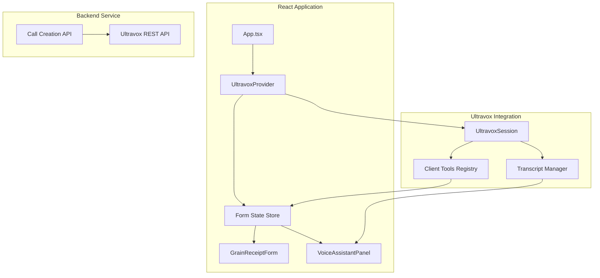

# Ultravox Voice AI Integration Architecture

## Executive Summary

This document outlines the comprehensive architecture for integrating Ultravox Realtime voice AI into the Agentic Form Filler application. The goal is to create a seamless voice-driven form-filling experience for seniors, where the AI assistant (FormAI) guides users through the Grain Receipt form via natural conversation while the UI updates in real-time.

---

## Table of Contents

1. [Project Analysis](#project-analysis)
2. [Architecture Overview](#architecture-overview)
3. [State Management Design](#state-management-design)
4. [Ultravox Integration Layer](#ultravox-integration-layer)
5. [Client Tools Definition](#client-tools-definition)
6. [Enhanced System Prompt](#enhanced-system-prompt)
7. [UI Components Updates](#ui-components-updates)
8. [Implementation Plan](#implementation-plan)
9. [File Structure](#file-structure)

---

## Project Analysis

### Current Application Structure

The application is a React 19 + TypeScript + Vite project with:

- **UI Framework**: Tailwind CSS v4 with glassmorphism design
- **Animation**: Framer Motion for smooth transitions
- **Form**: `GrainReceiptForm.tsx` - A grain receipt form with multiple sections:
  - Logistics & Identification (Producer Name, Licensee, Date, Receipt Number)
  - Weight Data (Gross Weight, Vehicle Tare, Net Weight)
  - Grading & Dockage (Grain Type, Dockage %)
  - Financials (Price per Tonne, Total Net Payable)

### Form Data Model (Current)

```typescript
interface FormData {
  receiptNumber: string;      // "GR-2024-8842" (read-only)
  licensee: string;           // "Prairie Grain Co-op" (read-only)
  producer: string;           // "Oliver Smith"
  date: string;               // "2024-11-20"
  grossWeight: number;        // 42500 kg
  vehicleWeight: number;      // 18200 kg
  pricePerTonne: number;      // 385.50
}

// Separate state
dockage: number;              // 2.5%

// Calculated fields
netWeight = grossWeight - vehicleWeight;
totalValue = (netWeight / 1000) * pricePerTonne * (1 - dockage / 100);
```

---

## Architecture Overview



### Key Architectural Decisions

1. **Centralized Form State**: Move form state to a shared store (React Context + useReducer) accessible by both UI and voice tools
2. **Client-Side Tools**: Ultravox tools run in the browser, directly manipulating React state
3. **Bidirectional Sync**: UI changes update state which Ultravox reads; voice commands update state which UI reflects
4. **Real-time Visual Feedback**: Highlight fields being discussed, show transcripts, animate changes

---

## State Management Design

### Form State Store

Create a centralized store using React Context + useReducer for predictable state updates:

```typescript
// src/store/formStore.ts

export interface GrainReceiptFormData {
  // Identification
  receiptNumber: string;
  licensee: string;
  producer: string;
  date: string;
  
  // Weights
  grossWeight: number;
  vehicleWeight: number;
  
  // Grading
  grainType: string;
  dockage: number;
  
  // Financials
  pricePerTonne: number;
}

export interface FormState {
  data: GrainReceiptFormData;
  activeField: string | null;        // Currently focused/discussed field
  validationErrors: Record<string, string>;
  isVoiceActive: boolean;
  lastUpdatedField: string | null;   // For UI highlight animation
  completedFields: string[];         // Track progress
}

export type FormAction =
  | { type: 'SET_FIELD'; field: keyof GrainReceiptFormData; value: string | number }
  | { type: 'SET_ACTIVE_FIELD'; field: string | null }
  | { type: 'SET_VALIDATION_ERROR'; field: string; error: string }
  | { type: 'CLEAR_VALIDATION_ERROR'; field: string }
  | { type: 'SET_VOICE_ACTIVE'; active: boolean }
  | { type: 'MARK_FIELD_COMPLETE'; field: string }
  | { type: 'RESET_FORM' };
```

### Context Provider Structure

```typescript
// src/store/FormContext.tsx

interface FormContextValue {
  state: FormState;
  dispatch: React.Dispatch<FormAction>;
  
  // Convenience methods for Ultravox tools
  setField: (field: string, value: string | number) => void;
  getField: (field: string) => string | number | undefined;
  getFormSummary: () => string;
  focusField: (field: string) => void;
  getProgress: () => { completed: number; total: number; percentage: number };
}
```

---

## Ultravox Integration Layer

### UltravoxProvider Component

```typescript
// src/ultravox/UltravoxProvider.tsx

interface UltravoxContextValue {
  session: UltravoxSession | null;
  status: UltravoxSessionStatus;
  transcripts: Transcript[];
  isConnected: boolean;
  
  // Methods
  startCall: () => Promise<void>;
  endCall: () => Promise<void>;
  sendMessage: (text: string) => void;
  muteMic: () => void;
  unmuteMic: () => void;
  isMicMuted: boolean;
}
```

### Call Configuration

```typescript
// src/ultravox/callConfig.ts

export const createCallConfig = (formSchema: string) => ({
  systemPrompt: generateSystemPrompt(formSchema),
  voice: "Jessica",  // Friendly, professional voice
  temperature: 0.4,  // Lower for more consistent form-filling
  recordingEnabled: true,
  firstSpeakerSettings: {
    agent: {
      text: "Hello! I'm FormAI, ready to help you fill out this grain receipt form. Feel free to interrupt me or ask for more information at any time. Let's start with your name - can you confirm you are Oliver Smith?"
    }
  },
  selectedTools: [
    // All client-side tools defined below
  ]
});
```

---

## Client Tools Definition

### Tool Categories

1. **Field Manipulation Tools** - Set/get form field values
2. **Navigation Tools** - Move between form sections
3. **Validation Tools** - Check field validity
4. **Utility Tools** - Summarize, confirm, end call

### Complete Tool Definitions

```typescript
// src/ultravox/tools.ts

export const formTools = [
  // ============================================
  // FIELD MANIPULATION TOOLS
  // ============================================
  {
    temporaryTool: {
      modelToolName: "setFieldValue",
      description: "Set the value of a form field. Use this when the user provides information for a specific field. Always confirm the value with the user after setting it.",
      dynamicParameters: [
        {
          name: "fieldName",
          location: "PARAMETER_LOCATION_BODY",
          schema: {
            type: "string",
            description: "The name of the field to update. Valid values: producer, date, grossWeight, vehicleWeight, grainType, dockage, pricePerTonne",
            enum: ["producer", "date", "grossWeight", "vehicleWeight", "grainType", "dockage", "pricePerTonne"]
          },
          required: true
        },
        {
          name: "value",
          location: "PARAMETER_LOCATION_BODY",
          schema: {
            type: "string",
            description: "The value to set. For numeric fields, provide as string (e.g., '42500' for weight, '2.5' for dockage percentage, '385.50' for price)"
          },
          required: true
        }
      ],
      client: {}
    }
  },
  
  {
    temporaryTool: {
      modelToolName: "getFieldValue",
      description: "Get the current value of a form field. Use this to check what value is currently entered before making changes or to confirm with the user.",
      dynamicParameters: [
        {
          name: "fieldName",
          location: "PARAMETER_LOCATION_BODY",
          schema: {
            type: "string",
            description: "The name of the field to retrieve",
            enum: ["producer", "date", "grossWeight", "vehicleWeight", "grainType", "dockage", "pricePerTonne", "receiptNumber", "licensee", "netWeight", "totalValue"]
          },
          required: true
        }
      ],
      client: {}
    }
  },
  
  // ============================================
  // NAVIGATION TOOLS
  // ============================================
  {
    temporaryTool: {
      modelToolName: "focusField",
      description: "Visually highlight and focus on a specific field in the UI. Use this when discussing a particular field to help the user locate it on screen.",
      dynamicParameters: [
        {
          name: "fieldName",
          location: "PARAMETER_LOCATION_BODY",
          schema: {
            type: "string",
            description: "The field to focus on",
            enum: ["producer", "date", "grossWeight", "vehicleWeight", "grainType", "dockage", "pricePerTonne"]
          },
          required: true
        }
      ],
      client: {}
    }
  },
  
  {
    temporaryTool: {
      modelToolName: "navigateToSection",
      description: "Scroll to and highlight a specific section of the form. Use when moving between major form sections.",
      dynamicParameters: [
        {
          name: "section",
          location: "PARAMETER_LOCATION_BODY",
          schema: {
            type: "string",
            description: "The section to navigate to",
            enum: ["logistics", "weights", "grading", "financials"]
          },
          required: true
        }
      ],
      client: {}
    }
  },
  
  // ============================================
  // VALIDATION & STATUS TOOLS
  // ============================================
  {
    temporaryTool: {
      modelToolName: "validateField",
      description: "Validate a specific field value. Returns validation result with any error messages.",
      dynamicParameters: [
        {
          name: "fieldName",
          location: "PARAMETER_LOCATION_BODY",
          schema: {
            type: "string",
            description: "The field to validate",
            enum: ["producer", "date", "grossWeight", "vehicleWeight", "grainType", "dockage", "pricePerTonne"]
          },
          required: true
        }
      ],
      client: {}
    }
  },
  
  {
    temporaryTool: {
      modelToolName: "getFormProgress",
      description: "Get the current completion progress of the form. Returns number of completed fields, total fields, and percentage.",
      dynamicParameters: [],
      client: {}
    }
  },
  
  {
    temporaryTool: {
      modelToolName: "getFormSummary",
      description: "Get a complete summary of all form fields and their current values. Use this to review the form with the user before submission.",
      dynamicParameters: [],
      client: {}
    }
  },
  
  // ============================================
  // UTILITY TOOLS
  // ============================================
  {
    temporaryTool: {
      modelToolName: "confirmValue",
      description: "Mark a field value as confirmed by the user. Use after the user verbally confirms a value is correct.",
      dynamicParameters: [
        {
          name: "fieldName",
          location: "PARAMETER_LOCATION_BODY",
          schema: {
            type: "string",
            description: "The field that was confirmed"
          },
          required: true
        }
      ],
      client: {}
    }
  },
  
  {
    temporaryTool: {
      modelToolName: "showHelp",
      description: "Display contextual help information for a specific field or section. Use when the user asks for clarification.",
      dynamicParameters: [
        {
          name: "topic",
          location: "PARAMETER_LOCATION_BODY",
          schema: {
            type: "string",
            description: "The topic to show help for",
            enum: ["producer", "date", "weights", "grossWeight", "vehicleWeight", "grainType", "dockage", "pricePerTonne", "general"]
          },
          required: true
        }
      ],
      client: {}
    }
  },
  
  {
    temporaryTool: {
      modelToolName: "hangUp",
      description: "End the voice call. Use ONLY when the user explicitly wants to end the call or when the form is complete and the user confirms they are finished.",
      dynamicParameters: [
        {
          name: "reason",
          location: "PARAMETER_LOCATION_BODY",
          schema: {
            type: "string",
            description: "The reason for ending the call",
            enum: ["completed", "user_requested", "error"]
          },
          required: true
        }
      ],
      client: {}
    }
  }
];
```

### Tool Implementation Registry

```typescript
// src/ultravox/toolImplementations.ts

import { FormContextValue } from '../store/FormContext';

export const createToolImplementations = (formContext: FormContextValue) => ({
  
  setFieldValue: ({ fieldName, value }: { fieldName: string; value: string }) => {
    const numericFields = ['grossWeight', 'vehicleWeight', 'dockage', 'pricePerTonne'];
    const parsedValue = numericFields.includes(fieldName) 
      ? parseFloat(value) 
      : value;
    
    formContext.setField(fieldName, parsedValue);
    formContext.focusField(fieldName);
    
    const displayValue = numericFields.includes(fieldName) 
      ? `${parsedValue}${fieldName === 'dockage' ? '%' : fieldName.includes('Weight') ? ' kg' : ''}`
      : value;
    
    return JSON.stringify({
      success: true,
      message: `Set ${fieldName} to ${displayValue}. Please confirm this value with the user.`,
      fieldName,
      newValue: parsedValue
    });
  },
  
  getFieldValue: ({ fieldName }: { fieldName: string }) => {
    const value = formContext.getField(fieldName);
    return JSON.stringify({
      fieldName,
      value: value ?? 'Not set',
      message: `The current value of ${fieldName} is ${value ?? 'not set'}.`
    });
  },
  
  focusField: ({ fieldName }: { fieldName: string }) => {
    formContext.focusField(fieldName);
    return JSON.stringify({
      success: true,
      message: `Now highlighting the ${fieldName} field on screen.`
    });
  },
  
  navigateToSection: ({ section }: { section: string }) => {
    // Dispatch navigation event
    window.dispatchEvent(new CustomEvent('ultravox:navigate', { 
      detail: { section } 
    }));
    return JSON.stringify({
      success: true,
      message: `Scrolled to the ${section} section.`
    });
  },
  
  validateField: ({ fieldName }: { fieldName: string }) => {
    const value = formContext.getField(fieldName);
    const errors = validateFieldValue(fieldName, value);
    return JSON.stringify({
      fieldName,
      isValid: errors.length === 0,
      errors,
      message: errors.length === 0 
        ? `The ${fieldName} field is valid.` 
        : `Validation errors for ${fieldName}: ${errors.join(', ')}`
    });
  },
  
  getFormProgress: () => {
    const progress = formContext.getProgress();
    return JSON.stringify({
      ...progress,
      message: `Form is ${progress.percentage}% complete. ${progress.completed} of ${progress.total} fields filled.`
    });
  },
  
  getFormSummary: () => {
    const summary = formContext.getFormSummary();
    return JSON.stringify({
      summary,
      message: summary
    });
  },
  
  confirmValue: ({ fieldName }: { fieldName: string }) => {
    formContext.dispatch({ type: 'MARK_FIELD_COMPLETE', field: fieldName });
    return JSON.stringify({
      success: true,
      message: `Marked ${fieldName} as confirmed. Moving to next field.`
    });
  },
  
  showHelp: ({ topic }: { topic: string }) => {
    const helpText = getHelpText(topic);
    window.dispatchEvent(new CustomEvent('ultravox:showHelp', { 
      detail: { topic, helpText } 
    }));
    return JSON.stringify({
      topic,
      helpText,
      message: helpText
    });
  },
  
  hangUp: ({ reason }: { reason: string }) => {
    window.dispatchEvent(new CustomEvent('ultravox:hangUp', { 
      detail: { reason } 
    }));
    return JSON.stringify({
      success: true,
      message: reason === 'completed' 
        ? 'Form completed! Ending the call. Thank you!'
        : 'Call ended. Thank you for using FormAI.'
    });
  }
});

// Validation helper
function validateFieldValue(fieldName: string, value: unknown): string[] {
  const errors: string[] = [];
  
  switch (fieldName) {
    case 'producer':
      if (!value || String(value).trim().length < 2) {
        errors.push('Producer name must be at least 2 characters');
      }
      break;
    case 'date':
      if (!value || !/^\d{4}-\d{2}-\d{2}$/.test(String(value))) {
        errors.push('Date must be in YYYY-MM-DD format');
      }
      break;
    case 'grossWeight':
    case 'vehicleWeight':
      if (!value || Number(value) <= 0) {
        errors.push(`${fieldName} must be a positive number`);
      }
      if (fieldName === 'vehicleWeight' && Number(value) > 50000) {
        errors.push('Vehicle weight seems too high');
      }
      break;
    case 'dockage':
      if (Number(value) < 0 || Number(value) > 100) {
        errors.push('Dockage must be between 0 and 100 percent');
      }
      break;
    case 'pricePerTonne':
      if (!value || Number(value) <= 0) {
        errors.push('Price must be a positive number');
      }
      break;
  }
  
  return errors;
}

// Help text helper
function getHelpText(topic: string): string {
  const helpTopics: Record<string, string> = {
    producer: "The producer is the person or business delivering the grain. This must match your registered producer name for payment processing.",
    date: "The delivery date is when the grain arrives at the elevator. It affects pricing and grade determination.",
    weights: "Gross weight is the total weight of truck plus grain. Vehicle tare is the empty truck weight. Net weight is calculated automatically.",
    grossWeight: "The gross weight is measured when the truck arrives fully loaded with grain. It should be measured on a certified scale.",
    vehicleWeight: "The vehicle tare weight is the weight of the empty truck. If you have a registered tare, we can use that. Otherwise, the truck is weighed after unloading.",
    grainType: "The grain type classification follows the Canadian Grain Commission standards. Common types include CWRS (Canada Western Red Spring) wheat.",
    dockage: "Dockage is the percentage deducted for foreign material, damaged kernels, and other factors. It's assessed by a licensed grain inspector.",
    pricePerTonne: "The price per tonne is based on current market rates for the specific grain type and grade at the time of delivery.",
    general: "I'm here to help you fill out this grain receipt form. Just tell me the information and I'll enter it for you. You can ask me to go back to any field at any time."
  };
  
  return helpTopics[topic] || helpTopics.general;
}
```

---

## Enhanced System Prompt

```typescript
// src/ultravox/systemPrompt.ts

export const generateSystemPrompt = (formSchema: string): string => `
# FormAI Voice Assistant - Grain Receipt Form

You are FormAI, a patient, friendly voice assistant designed specifically to help seniors fill out government forms. You are currently helping the user complete a **Grain Receipt Form** (Primary Elevator Receipt - Form 6).

## Your Core Personality

- **Patient & Understanding**: Never rush the user. Repeat information if asked. Speak clearly and at a moderate pace.
- **Warm & Reassuring**: Use a friendly, conversational tone. Make the user feel comfortable.
- **Clear & Concise**: Give one piece of information at a time. Avoid jargon.
- **Proactive Helper**: Anticipate confusion and offer clarification before being asked.
- **Respectful of Expertise**: The user is an experienced grain producer - respect their knowledge while helping with the form.

## Form Structure

The form has four sections:
1. **Logistics & Identification**: Producer name, delivery date
2. **Weight Data**: Gross weight (truck + grain), vehicle tare weight (empty truck)
3. **Grading & Dockage**: Grain type, dockage percentage
4. **Financials**: Price per tonne

**Read-only fields** (shown for reference but cannot be changed):
- Receipt Number: GR-2024-8842
- Licensee: Prairie Grain Co-op

**Calculated fields** (computed automatically):
- Net Weight = Gross Weight - Vehicle Tare Weight
- Total Value = (Net Weight / 1000) × Price × (1 - Dockage%)

## Current Form State

${formSchema}

## Conversation Guidelines

### Starting the Call
Begin by greeting the user warmly and confirming their identity. Then ask about the first editable field (producer name confirmation).

### Field-by-Field Approach
1. **One field at a time**: Focus on a single field before moving on
2. **State current value**: If a field has a value, tell the user what it is
3. **Request confirmation or update**: Ask if it's correct or if they want to change it
4. **Confirm after changes**: Always read back what you entered
5. **Visual feedback**: Use the focusField tool so they can see which field you're discussing

### Handling Numbers
- For weights, speak the number clearly and confirm: "That's forty-two thousand five hundred kilograms, correct?"
- For percentages, be explicit: "Two point five percent dockage"
- For money, say "dollars" and "cents": "Three hundred eighty-five dollars and fifty cents per tonne"

### Handling Dates
- Accept natural language: "yesterday", "November 20th", "the 20th of last month"
- Always confirm in full: "So that's November 20th, 2024?"

### Error Handling
- If a value doesn't make sense, gently ask for clarification
- If the user seems confused, offer to explain the field
- If you misheard, apologize and ask them to repeat

### Navigation
- Always tell the user where you are: "Now let's move to the weight section"
- Offer to go back: "Would you like to change anything in the identification section?"
- Use section navigation for big jumps

### Ending the Call
1. Summarize all entered information using getFormSummary
2. Ask if everything looks correct
3. If confirmed, mark as complete and use hangUp with reason "completed"
4. If they want changes, go back to the relevant field

## Tool Usage Rules

1. **Always use focusField** when discussing a field - this highlights it on screen
2. **Use setFieldValue** only after the user clearly provides a value
3. **Use getFieldValue** to check current values before asking about them
4. **Use confirmValue** only after the user explicitly confirms a value is correct
5. **Use getFormProgress** periodically to track and communicate progress
6. **Use showHelp** when the user asks "what is this?" or seems confused
7. **Use hangUp** ONLY when:
   - The form is complete AND user confirms
   - The user explicitly asks to end the call
   - There's an unrecoverable error

## Response Format

Keep responses SHORT and conversational:
- ❌ "I have successfully updated the producer name field to Oliver Smith. The value has been saved."
- ✅ "Got it, Oliver Smith. Is that spelled correctly?"

Wait for user responses. Don't fill silence with excessive chatter.

## Example Interactions

**Confirming a value:**
User: "Yeah that's right"
FormAI: "Perfect. [confirmValue] Now, let's check the delivery date. [focusField: date] I have November 20th, 2024. Does that look correct?"

**Updating a value:**
User: "Actually the gross weight should be 43,000"
FormAI: "No problem, let me update that. [setFieldValue: grossWeight, 43000] [focusField: grossWeight] Changed to 43,000 kilograms. That brings your net weight to... [getFieldValue: netWeight] 24,800 kilograms. Sound right?"

**User is confused:**
User: "What's dockage again?"
FormAI: "[showHelp: dockage] Dockage is the percentage they deduct for things like foreign material or damaged kernels in your grain. The inspector determines this when they grade your load. You have 2.5% entered right now."

**Ending the call:**
User: "I think we're done"
FormAI: "[getFormSummary] Alright, let me read back everything one more time... [reads summary]. Does all of that look correct to you?"
User: "Yes, looks good"
FormAI: "[confirmValue for remaining fields] Wonderful! Your grain receipt is all filled out. You can print it or submit it from the dashboard. Thanks for using FormAI today! [hangUp: completed]"
`.trim();
```

---

## UI Components Updates

### New Components Required

```
src/
├── components/
│   ├── voice/
│   │   ├── VoiceAssistantPanel.tsx      # Main voice UI panel
│   │   ├── VoiceOrb.tsx                 # Animated speaking indicator
│   │   ├── TranscriptDisplay.tsx        # Live transcript view
│   │   ├── VoiceControlBar.tsx          # Mute/end call controls
│   │   └── FieldHighlight.tsx           # Field focus indicator
│   └── ...
├── store/
│   ├── FormContext.tsx                  # Form state context
│   └── formReducer.ts                   # State reducer
├── ultravox/
│   ├── UltravoxProvider.tsx             # Ultravox session provider
│   ├── useUltravox.ts                   # Hook for Ultravox operations
│   ├── callConfig.ts                    # Call configuration
│   ├── tools.ts                         # Tool definitions
│   ├── toolImplementations.ts           # Client tool logic
│   └── systemPrompt.ts                  # System prompt generator
└── ...
```

### GrainReceiptForm Modifications

The form needs updates to:
1. Use the shared FormContext instead of local state
2. React to `activeField` changes with visual highlighting
3. Listen for navigation events from voice tools
4. Show real-time updates when voice changes values

```typescript
// Key changes to GrainReceiptForm.tsx

// 1. Use FormContext
const { state, dispatch } = useFormContext();

// 2. Field highlighting
const isFieldActive = state.activeField === 'producer';
const wasJustUpdated = state.lastUpdatedField === 'producer';

// 3. Apply visual effects
<SuperInput 
  className={cn(
    isFieldActive && "ring-4 ring-gov-blue/50 animate-pulse",
    wasJustUpdated && "animate-field-update"
  )}
/>

// 4. Section navigation listener
useEffect(() => {
  const handleNavigate = (e: CustomEvent) => {
    const sectionRef = sectionRefs[e.detail.section];
    sectionRef?.scrollIntoView({ behavior: 'smooth' });
  };
  window.addEventListener('ultravox:navigate', handleNavigate);
  return () => window.removeEventListener('ultravox:navigate', handleNavigate);
}, []);
```

### VoiceAssistantPanel Component

```typescript
// src/components/voice/VoiceAssistantPanel.tsx

interface VoiceAssistantPanelProps {
  className?: string;
}

export const VoiceAssistantPanel: React.FC<VoiceAssistantPanelProps> = () => {
  const { status, transcripts, startCall, endCall, isMicMuted, muteMic, unmuteMic } = useUltravox();
  const { state } = useFormContext();
  
  return (
    <GlassCard className="fixed bottom-6 right-6 w-96 max-h-[500px]">
      {/* Voice Orb with status indicator */}
      <VoiceOrb status={status} />
      
      {/* Transcript Display */}
      <TranscriptDisplay transcripts={transcripts} />
      
      {/* Current field indicator */}
      {state.activeField && (
        <div className="text-sm text-gov-blue">
          Discussing: {state.activeField}
        </div>
      )}
      
      {/* Control Bar */}
      <VoiceControlBar 
        isConnected={status !== 'disconnected'}
        isMuted={isMicMuted}
        onStart={startCall}
        onEnd={endCall}
        onToggleMute={isMicMuted ? unmuteMic : muteMic}
      />
    </GlassCard>
  );
};
```

---

## Implementation Plan

### Phase 1: Foundation (Core Infrastructure)

| Task | Description | Files |
|------|-------------|-------|
| 1.1 | Install ultravox-client SDK | `package.json` |
| 1.2 | Create Form State Context | `src/store/FormContext.tsx`, `src/store/formReducer.ts` |
| 1.3 | Create Ultravox Provider | `src/ultravox/UltravoxProvider.tsx` |
| 1.4 | Define tool configurations | `src/ultravox/tools.ts` |
| 1.5 | Implement tool functions | `src/ultravox/toolImplementations.ts` |
| 1.6 | Create system prompt | `src/ultravox/systemPrompt.ts` |

### Phase 2: UI Integration (Visual Components)

| Task | Description | Files |
|------|-------------|-------|
| 2.1 | Create VoiceOrb component | `src/components/voice/VoiceOrb.tsx` |
| 2.2 | Create TranscriptDisplay | `src/components/voice/TranscriptDisplay.tsx` |
| 2.3 | Create VoiceControlBar | `src/components/voice/VoiceControlBar.tsx` |
| 2.4 | Create VoiceAssistantPanel | `src/components/voice/VoiceAssistantPanel.tsx` |
| 2.5 | Add field highlight animations | `src/index.css` |

### Phase 3: Form Integration (Connect Everything)

| Task | Description | Files |
|------|-------------|-------|
| 3.1 | Migrate GrainReceiptForm to use FormContext | `src/components/views/GrainReceiptForm.tsx` |
| 3.2 | Add field highlighting logic | `src/components/views/GrainReceiptForm.tsx` |
| 3.3 | Add section navigation | `src/components/views/GrainReceiptForm.tsx` |
| 3.4 | Update SuperInput for voice integration | `src/components/ui/SuperInput.tsx` |

### Phase 4: App Assembly (Wire Up)

| Task | Description | Files |
|------|-------------|-------|
| 4.1 | Update App.tsx with providers | `src/App.tsx` |
| 4.2 | Update Sidebar with voice status | `src/components/layout/Sidebar.tsx` |
| 4.3 | Add voice panel to form view | `src/App.tsx` |

### Phase 5: Backend & Configuration

| Task | Description | Files |
|------|-------------|-------|
| 5.1 | Create call initiation endpoint | `src/api/createCall.ts` (or use environment directly) |
| 5.2 | Add environment configuration | `.env`, `.env.example` |
| 5.3 | Create call configuration factory | `src/ultravox/callConfig.ts` |

### Phase 6: Testing & Polish

| Task | Description | Files |
|------|-------------|-------|
| 6.1 | Test all voice tools | Manual testing |
| 6.2 | Refine system prompt based on testing | `src/ultravox/systemPrompt.ts` |
| 6.3 | Add error handling & edge cases | Various |
| 6.4 | Performance optimization | Various |

---

## File Structure

### Final Project Structure

```
src/
├── api/
│   └── ultravox.ts                      # API calls for Ultravox REST API
├── components/
│   ├── layout/
│   │   └── Sidebar.tsx                  # Updated with voice status
│   ├── ui/
│   │   ├── AnimatedNumber.tsx
│   │   ├── GlassCard.tsx
│   │   └── SuperInput.tsx               # Updated with voice integration
│   ├── views/
│   │   ├── AccessibilitySettings.tsx
│   │   ├── Dashboard.tsx
│   │   └── GrainReceiptForm.tsx         # Updated to use FormContext
│   └── voice/
│       ├── FieldHighlight.tsx           # NEW: Visual field highlighting
│       ├── TranscriptDisplay.tsx        # NEW: Live transcripts
│       ├── VoiceAssistantPanel.tsx      # NEW: Main voice UI
│       ├── VoiceControlBar.tsx          # NEW: Controls
│       └── VoiceOrb.tsx                 # NEW: Status indicator
├── hooks/
│   └── useUltravox.ts                   # NEW: Ultravox hook
├── lib/
│   └── utils.ts
├── store/
│   ├── FormContext.tsx                  # NEW: Form state context
│   └── formReducer.ts                   # NEW: State reducer
├── ultravox/
│   ├── callConfig.ts                    # NEW: Call configuration
│   ├── systemPrompt.ts                  # NEW: System prompt
│   ├── toolImplementations.ts           # NEW: Tool logic
│   ├── tools.ts                         # NEW: Tool definitions
│   └── UltravoxProvider.tsx             # NEW: Session provider
├── App.css
├── App.tsx                              # Updated with providers
├── index.css
├── main.tsx
└── vite-env.d.ts

Additional files:
├── .env.example                         # NEW: Environment template
└── docs/
    └── ULTRAVOX_ARCHITECTURE.md         # This document
```

---

## Environment Configuration

```env
# .env.example

# Ultravox API Configuration
VITE_ULTRAVOX_API_KEY=your-api-key-here
VITE_ULTRAVOX_API_BASE=https://api.ultravox.ai/api

# Optional: Voice Configuration
VITE_ULTRAVOX_VOICE=Jessica
VITE_ULTRAVOX_TEMPERATURE=0.4
```

---

## Security Considerations

1. **API Key Protection**: The Ultravox API key should ideally be used server-side. For this demo, we use `X-Unsafe-API-Key` with understanding of risks.

2. **For Production**: Create a simple backend endpoint that creates calls and returns the `joinUrl`:
   ```
   POST /api/ultravox/create-call
   Response: { joinUrl: string }
   ```

3. **Client-side Security**: All form data stays in the browser. No sensitive data is sent to external servers except through Ultravox's encrypted WebSocket connection.

---

## Summary

This architecture provides:

1. **Seamless Voice Integration**: Ultravox handles all speech recognition and synthesis
2. **Real-time UI Updates**: Client-side tools directly manipulate React state
3. **Bidirectional Sync**: Users can use voice or manual input interchangeably
4. **Senior-Friendly Design**: Patient prompts, clear confirmations, visual highlighting
5. **Robust Tool Set**: Complete coverage of form operations
6. **Maintainable Structure**: Clear separation of concerns, typed throughout

The implementation follows Ultravox best practices for client tools while leveraging React's state management patterns for a responsive, real-time user experience.